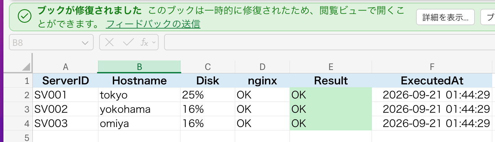
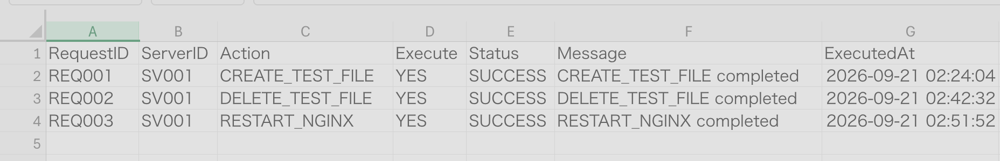
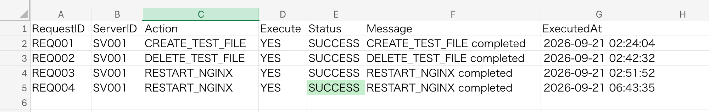
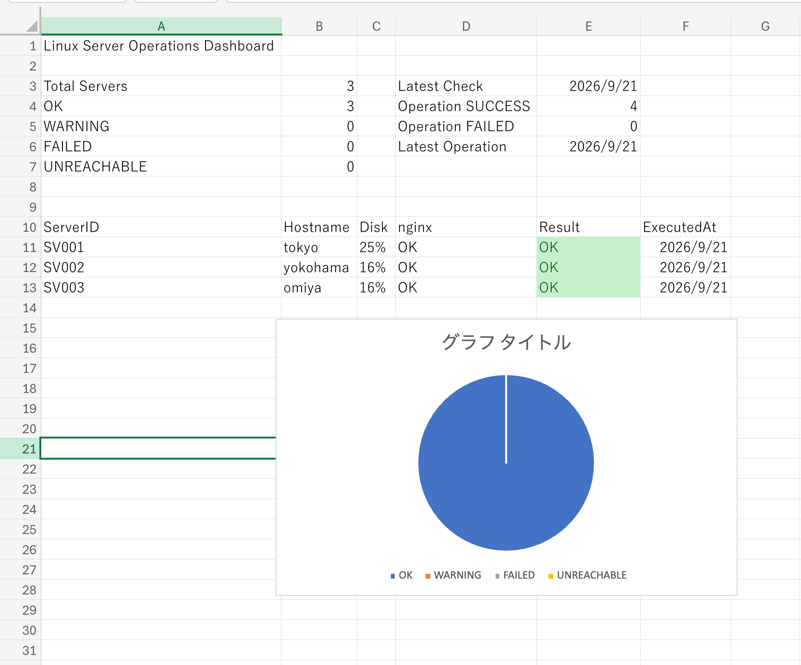

# Linuxサーバー運用ラボ

## プロジェクト概要

このリポジトリは、自宅のVirtualBox環境を使って、Linuxサーバの管理・自動化・障害対応を学習した記録です。

主に2つのテーマに取り組みました。

**① Excel × Python × Ansible × Linuxによる運用自動化**

Ubuntu Server 3台を対象に、Excelの管理台帳からAnsible Inventoryを生成し、サーバの一括点検、結果のExcelへの書き戻し、操作指示、nginx障害の検知・復旧までを検証しました。

**② Linux運用保守の実機検証（全8テーマ）**

nginxの停止、設定ミス、ファイル権限、ディスク容量不足、DNS、SSH、バックアップ・復元などを検証しました。

正常状態の確認から、障害再現、原因調査、修正、復旧確認までの流れを記録しています。

いずれも自宅の検証環境で実施した学習成果であり、本番環境での運用実績ではありません。

## 成果物一覧

| 成果物 | 内容 | リンク |
|---|---|---|
| 運用自動化プロジェクト | Excel・Python・Ansible・Linuxを連携したPhase 1〜10の検証 | [検証内容を見る](#phase-1linuxpythonansible環境確認) |
| Linux運用保守の実機検証 | 障害再現・原因調査・復旧確認の8テーマ | [8テーマ一覧を見る](#実機検証シナリオ全8テーマ) |
| 検証手順 | 実行コマンド・結果・切り分け手順 | [scenariosフォルダ](scenarios/) |
| Phaseレビュー資料 | 各Phaseの振り返りPDF | [docsフォルダ](docs/) |

## 目次

### 運用自動化プロジェクト

- [システム構成](#システム構成)
- [検証環境](#検証環境)
- [ディレクトリ構成](#ディレクトリ構成)
- [Phase 1：環境確認](#phase-1linuxpythonansible環境確認)
- [Phase 2：Excelサーバ管理台帳](#phase-2excelサーバ管理台帳)
- [Phase 3：PythonからExcelを読み込む](#phase-3pythonからexcelを読み込む)
- [Phase 4：Ansible Inventory生成](#phase-4excelからansible-inventoryを生成)
- [Phase 5：Linux日次点検](#phase-5ansibleによるlinux日次点検)
- [Phase 6：Ansible結果解析](#phase-6pythonでansible結果を解析)
- [Phase 7：Excelへの結果書き戻し](#phase-7点検結果をexcelへ自動書き戻し)
- [Phase 8：ExcelからLinuxを操作](#phase-8excelからlinuxを操作)
- [Phase 9：障害検知・復旧](#phase-9障害検知復旧)
- [Phase 10：Excelダッシュボード](#phase-10excelダッシュボード)

### Linux運用保守の実機検証

- [全8テーマの検証一覧](#実機検証シナリオ全8テーマ)
- [nginx停止障害](scenarios/01_nginx_stop.md)
- [nginx設定ミス](scenarios/02_nginx_config_error.md)
- [403 Forbidden・ファイル権限](scenarios/03_permission_error.md)
- [ディスク容量不足](scenarios/04_disk_full.md)
- [DNS・ネットワーク](scenarios/05_dns_troubleshooting.md)
- [SSH接続障害](scenarios/06_ssh_troubleshooting.md)
- [バックアップと復元](scenarios/07_backup_restore.md)
- [最終演習](scenarios/08_final_recovery.md)

### 資料・その他

- [Phaseレビュー資料](#phaseレビュー資料)
- [セキュリティについて](#セキュリティについて)
- [今後の発展案](#今後の発展案)

---

Excel × Python × Ansible × Linux を組み合わせて、  
Linuxサーバ3台の管理・点検・操作・障害復旧を自動化する検証プロジェクトです。

単純にAnsibleのPlaybookを実行するだけではなく、

- Excelをサーバ管理台帳として使用
- PythonでExcelを読み込む
- Ansible Inventoryを自動生成
- Linuxサーバを一括点検
- Ansibleの実行結果をPythonで解析
- 点検結果をExcelへ自動書き戻し
- ExcelからLinuxへの操作指示
- nginx障害の検知・復旧
- Excelダッシュボードで状態を可視化

までを一連の流れとして構築しました。

---

## このプロジェクトでできること

このプロジェクトでは、Excelを単なる管理表ではなく、

- サーバ管理台帳
- 点検結果確認画面
- Linuxへの操作指示画面
- 障害復旧の起点
- 運用ダッシュボード

として利用しています。

最終的には、

```text
Excel
  ↓
Python
  ↓
Ansible
  ↓
Linux Servers
  ↓
Pythonで結果解析
  ↓
Excelへ書き戻し
```

という双方向の運用フローを構築しました。

---

# システム構成

```text
Mac
│
│ Excel
│ Linux_Server_Operations_Lab.xlsx
│
├── 01_SERVER_MASTER
├── 02_CHECK_RESULTS
├── 03_OPERATION_REQUESTS
└── 04_DASHBOARD
        │
        │ VirtualBox共有フォルダ
        ▼
Ubuntu Controller
        │
        ├── Python
        │
        └── Ansible
                │
                ├── tokyo
                ├── yokohama
                └── omiya
```

ExcelとController間では、VirtualBoxの共有フォルダを使用しています。

これにより、Excelファイルを毎回scpで送受信する必要がなくなり、  
MacとLinuxから同じExcelファイルを扱えるようにしました。

---

# 検証環境

## Controller

| 項目 | 内容 |
|---|---|
| OS | Ubuntu 24.04 |
| Python | 3.12 |
| Ansible | Core 2.16 |
| Excel操作 | openpyxl |
| 仮想環境 | VirtualBox |

## Managed Servers

| ServerID | Hostname | IP Address | OS | Role | Environment |
|---|---|---|---|---|---|
| SV001 | tokyo | 192.168.56.11 | Ubuntu 24.04 | web | DEV |
| SV002 | yokohama | 192.168.56.12 | Ubuntu 24.04 | web | DEV |
| SV003 | omiya | 192.168.56.13 | Ubuntu 24.04 | web | DEV |

※ IPアドレスはVirtualBox内の検証用プライベートネットワークです。

---

# ディレクトリ構成

a
                └── omiya
```

ExcelとController間では、VirtualBoxの共有フォルダを使用しています。

これにより、Excelファイルを毎回scpで送受信する必要がなくなり、  
MacとLinuxから同じExcelファイルを扱えるようにしました。

---

# 検証環境

## Controller

| 項目 | 内容 |
|---|---|
| OS | Ubuntu 24.04 |
| Python | 3.12 |
| Ansible | Core 2.16 |
| Excel操作 | openpyxl |
| 仮想環境 | VirtualBox |

## Managed Servers

| ServerID | Hostname | IP Address | OS | Role | Environment |
|---|---|---|---|---|---|
| SV001 | tokyo | 192.168.56.11 | Ubuntu 24.04 | web | DEV |
| SV002 | yokohama | 192.168.56.12 | Ubuntu 24.04 | web | DEV |
| SV003 | omiya | 192.168.56.13 | Ubuntu 24.04 | web | DEV |

※ IPアドレスはVirtualBox内の検証用プライベートネットワークです。

```text
linux-server-operations-lab/
├── inventory/
│   ├── hosts.ini
│   └── hosts_generated.ini
│
├── playbooks/
│   └── daily_check.yml
│
├── scripts/
│   ├── analyze_results.py
│   ├── execute_operations.py
│   └── write_results.py
│

---

# Phase 1：Linux・Python・Ansible環境確認

最初にControllerとManaged Server間の基本的な接続を確認しました。

確認した内容：

- hostname
- IPアドレス
- Pythonバージョン
- Ansibleバージョン
- ping
- SSH接続
- Python subprocess
- Ansible ping

PythonからLinuxコマンドを実行し、

```text
stdout
stderr
returncode
```

の意味も確認しました。

正常終了時は、

```text
returncode = 0
```

失敗時は、

```text
returncode != 0
```

となることを利用して、後の状態判定につなげています。

---

# Phase 2：Excelサーバ管理台帳

Excelに、

```text
01_SERVER_MASTER
```

を作成しました。

管理項目：

```text
ServerID
Hostname
IP_Address
OS
Role
Environment
```

登録例：

| ServerID | Hostname | IP_Address | OS | Role | Environment |
|---|---|---|---|---|---|
| SV001 | tokyo | 192.168.56.11 | Ubuntu 24.04 | web | DEV |
| SV002 | yokohama | 192.168.56.12 | Ubuntu 24.04 | web | DEV |
| SV003 | omiya | 192.168.56.13 | Ubuntu 24.04 | web | DEV |

RoleやEnvironmentには入力規則を設定しました。

```text
Role
web
app
db

Environment
DEV
STG
PROD
```

入力をプルダウン化することで、表記揺れや入力ミスを防いでいます。

---

# Phase 3：PythonからExcelを読み込む

Pythonの `openpyxl` を使用してExcelを読み込みました。

実施内容：

- Excelファイル読込
- Sheet取得
- セル取得
- 行データ取得
- 辞書形式への変換
- 必須項目チェック
- Environmentチェック
- Roleチェック
- IPアドレス形式チェック

IPアドレスのチェックにはPython標準ライブラリの、

```python
ipaddress
```

を使用しました。

Excelを人間が管理する入力画面、  
Pythonをデータ検証担当として分けています。

---

# Phase 4：ExcelからAnsible Inventoryを生成

Excelの `01_SERVER_MASTER` からPythonでAnsible Inventoryを生成しました。

生成例：

```ini
[servers]
tokyo ansible_host=192.168.56.11 ansible_user=tokyo
yokohama ansible_host=192.168.56.12 ansible_user=yokohama
omiya ansible_host=192.168.56.13 ansible_user=omiya
```

生成ファイル：

```text
inventory/hosts_generated.ini
```

生成後、

```bash
ansible servers -i inventory/hosts_generated.ini -m ping
```

を実行し、3台すべて、

```text
SUCCESS
pong
```

になることを確認しました。

---

# Phase 5：AnsibleによるLinux日次点検

Ansible Playbookを使用して、3台のLinuxサーバを一括点検しました。

Playbook：

```text
playbooks/daily_check.yml
```

取得項目：

```text
uptime
memory
disk
OS
IP address
nginx
CPU
```

3台に対して同じ確認コマンドを個別実行するのではなく、  
Ansibleで一括取得する構成にしました。

最終的なPlay Recapでは、

```text
ok=14
changed=0
unreachable=0
failed=0
```

を確認しました。

---

# Phase 6：PythonでAnsible結果を解析

PythonからAnsibleを実行し、取得結果を解析しました。

スクリプト：

```text
scripts/analyze_results.py
```

Disk使用率を正規表現で取得し、

```text
80%以上 → WARNING
80%未満 → OK
```

として判定しました。

さらに、

```text
OK
WARNING
FAILED
UNREACHABLE
```

の4状態を判定できるようにしました。

正常時の例：

```text
omiya Disk=16% nginx=OK Result=OK
tokyo Disk=25% nginx=OK Result=OK
yokohama Disk=16% nginx=OK Result=OK
```

接続できないサーバについては、

```text
UNREACHABLE
```

として判定します。

---

# Phase 7：点検結果をExcelへ自動書き戻し

Linuxの点検結果をExcelへ自動反映する仕組みを作成しました。

使用シート：

```text
02_CHECK_RESULTS
```

項目：

```text
ServerID
Hostname
Disk
nginx
Result
ExecutedAt
```

スクリプト：

```text
scripts/write_results.py
```

処理フロー：

```text
Linux
↓
Ansible
↓
Python
↓
状態判定
↓
Excelへ書き戻し
```

結果例：

| ServerID | Hostname | Disk | nginx | Result |
|---|---|---|---|---|
| SV001 | tokyo | 25% | OK | OK |
| SV002 | yokohama | 16% | OK | OK |
| SV003 | omiya | 16% | OK | OK |

Resultは状態に応じて色分けしています。

```text
OK          → 緑
WARNING     → 黄
FAILED      → 赤
UNREACHABLE → 赤
```

## 点検結果画面



---

# Phase 8：ExcelからLinuxを操作

ExcelからLinuxへの操作指示を出せるようにしました。

使用シート：

```text
03_OPERATION_REQUESTS
```

項目：

```text
RequestID
ServerID
Action
Execute
Status
Message
ExecutedAt
```

対応Action：

```text
CREATE_TEST_FILE
DELETE_TEST_FILE
RESTART_NGINX
```

操作例：

```text
REQ001
SV001
CREATE_TEST_FILE
YES
```

Pythonがこの指示を読み込み、

```text
SV001
↓
tokyo
```

へ変換します。

その後Ansibleを実行し、Linuxへ操作を反映します。

処理結果はExcelへ、

```text
SUCCESS
FAILED
```

として返します。

SUCCESS済みのRequestは再実行しないようにしています。

```python
if status == "SUCCESS":
    continue
```

これにより、同じ操作が何度も実行されることを防止しています。

## 操作指示画面



---

# Phase 9：障害検知・復旧

tokyoのnginxを意図的に停止させ、障害対応を検証しました。

まず、

```bash
sudo systemctl stop nginx
```

を実行。

確認結果：

```text
inactive
```

Ansibleから確認すると、

```text
tokyo | FAILED | rc=3
inactive
```

となりました。

Pythonで点検すると、

```text
SV001 tokyo Disk=25% nginx=FAILED Result=FAILED
SV002 yokohama Disk=17% nginx=OK Result=OK
SV003 omiya Disk=16% nginx=OK Result=OK
```

となり、tokyoだけ異常を検知できました。

その後Excelへ、

```text
REQ004
SV001
RESTART_NGINX
YES
```

を登録。

Python → Ansibleを経由してnginxを再起動しました。

実行結果：

```text
SUCCESS
```

再度点検すると、

```text
SV001 tokyo Disk=25% nginx=OK Result=OK
SV002 yokohama Disk=16% nginx=OK Result=OK
SV003 omiya Disk=16% nginx=OK Result=OK
```

となり、正常復帰を確認しました。

---

# タイムアウト対策

Phase 9の障害検証中、PythonがAnsibleの終了を待ち続けるケースが発生しました。

そのため、

```text
Ansible SSH timeout
Python subprocess timeout
```

を追加しました。

例：

```python
timeout=30
```

Ansible側：

```text
-T 5
```

これにより、自動化処理そのものが無期限に停止するリスクを減らしています。

## 障害復旧結果



---

# Phase 10：Excelダッシュボード

最終Phaseとして、

```text
04_DASHBOARD
```

を作成しました。

表示内容：

```text
Total Servers
OK
WARNING
FAILED
UNREACHABLE
Latest Check
Operation SUCCESS
Operation FAILED
Latest Operation
```

さらに、

```text
ServerID
Hostname
Disk
nginx
Result
ExecutedAt
```

の現在状態一覧を表示します。

使用した主なExcel関数：

```text
COUNTA
COUNTIF
MAX
XLOOKUP
```

Result列には条件付き書式を設定しています。

また、

```text
OK
WARNING
FAILED
UNREACHABLE
```

の件数をグラフ化し、現在のサーバ状態を視覚的に確認できるようにしました。

## ダッシュボード



---

# 完成した運用フロー

このプロジェクトでは、最終的に以下の流れを実現しました。

```text
Excelサーバ台帳
↓
Pythonで読み込み
↓
Ansible Inventory生成
↓
Linux 3台を一括点検
↓
Pythonで結果解析
↓
Excelへ自動書き戻し
↓
Excelから操作指示
↓
Python
↓
Ansible
↓
Linux操作
↓
障害検知
↓
Excelから復旧指示
↓
再点検
↓
Dashboardで可視化
```

---

# 各技術の役割

| 技術 | 役割 |
|---|---|
| Excel | サーバ管理台帳・点検結果・操作指示・ダッシュボード |
| Python | Excel読込・検証・Ansible実行・結果解析・Excel書き戻し |
| Ansible | Linuxサーバへの一括点検・操作 |
| Linux | 実際に管理されるサーバ環境 |

---

# このプロジェクトで学んだこと

この検証を通して、

- Excelによるサーバ情報管理
- PythonによるExcel操作
- PythonからAnsibleを実行する方法
- Ansible Inventoryの自動生成
- 複数Linuxサーバの一括管理
- Ansible実行結果の解析
- Excelへの自動書き戻し
- ExcelからのLinux操作
- 障害検知
- 障害復旧
- 再実行防止
- タイムアウト設計
- sudo権限制御
- 条件付き書式
- XLOOKUP / COUNTIF / COUNTA / MAX
- ダッシュボード作成

を一つのプロジェクトとして経験しました。

---

# 工夫したポイント

このプロジェクトでは、正常系だけでなく意図的に失敗を発生させています。

例えば、

```text
SSH接続失敗
nginx停止
UNREACHABLE
FAILED
sudo権限エラー
Pythonの待ち状態
```

などを実際に発生させ、

```text
事象確認
↓
原因候補
↓
切り分け
↓
修正
↓
再確認
```

という流れで検証しました。

単に成功するコードを作るだけでなく、  
失敗した場合にどう調査するかも重要な学習対象としています。

---

# セキュリティについて

GitHubには以下の情報を登録しないようにしています。

```text
パスワード
SSH秘密鍵
API Token
Personal Access Token
.env
Credential情報
```

`.gitignore` を使用して、認証情報や一時ファイルをGit管理対象から除外しています。

また、nginx再起動については無制限なsudo権限を付与せず、  
必要な操作のみ許可する形で検証しています。

---

# 今後の発展案

今後は以下への発展を検討しています。

```text
AWX
REST API
GitHub Actions
点検履歴の蓄積
障害履歴管理
バックアップ自動化
Linuxユーザー管理
セキュリティ設定
DEV / STG / PROD制御
Web UI
通知機能
```

特に、次のステップとしてAWXやAPIを利用し、  
GUI / API / CLIからAnsibleを操作する仕組みへの発展を考えています。

---

# 注意事項

このリポジトリは、自宅のVirtualBox検証環境で作成した学習・ポートフォリオ用プロジェクトです。

そのまま本番環境へ適用することを目的としていません。

本番利用する場合は、

```text
認証情報管理
権限制御
監査ログ
エラーハンドリング
冪等性
バックアップ
承認フロー
セキュリティ
監視
```

などを別途設計する必要があります。

---

# Author

インフラ運用・Linux・Ansible・Python・自動化を学習しながら、  
実際に手を動かして検証した内容をポートフォリオとして公開しています。

# Phaseレビュー資料

各Phaseで実施した内容・コマンド・トラブルシュート・学びをPDFにまとめています。

- [Phase 2 Review](docs/Linux_Server_Operations_Lab_Phase2_Review.pdf)
- [Phase 3 Review](docs/Linux_Server_Operations_Lab_Phase3_Review.pdf)
- [Phase 4 Review](docs/Linux_Server_Operations_Lab_Phase4_Review.pdf)
- [Phase 5 Review](docs/Linux_Server_Operations_Lab_Phase5_Review.pdf)
- [Phase 6 Review](docs/Linux_Server_Operations_Lab_Phase6_Review.pdf)
- [Phase 7 Review](docs/Linux_Server_Operations_Lab_Phase7_Review.pdf)
- [Phase 8 Review](docs/Linux_Server_Operations_Lab_Phase8_Review.pdf)
- [Phase 9 Review](docs/Linux_Server_Operations_Lab_Phase9_Review.pdf)
- [Phase 10 Review](docs/Linux_Server_Operations_Lab_Phase10_Review.pdf)

### Linux運用保守・実機検証の総括資料

全8テーマの検証目的、実施内容、障害の切り分け、復旧確認、学んだことをまとめたPDFです。

- [Linux運用保守・実機検証 総括PDF（全8テーマ）](docs/Linux_Server_Operations_Lab_Complete_Review_Phase1-8.pdf)


## 実機検証シナリオ（全8テーマ）

VirtualBox上のUbuntu Server 24.04を使用し、Linuxサーバの運用保守を想定した障害再現・原因調査・復旧確認を実施しました。

各シナリオでは、実際に使用したコマンド、確認結果、学んだことをまとめています。

| No. | 検証テーマ | 検証内容 |
|---|---|---|
| 01 | [nginx停止障害](scenarios/01_nginx_stop.md) | サービス停止・状態確認・復旧 |
| 02 | [nginx設定ミス](scenarios/02_nginx_config_error.md) | 設定エラー・起動失敗・修正 |
| 03 | [403 Forbidden](scenarios/03_permission_error.md) | ファイル権限・エラーログ・復旧 |
| 04 | [ディスク容量不足](scenarios/04_disk_full.md) | 容量不足の再現・調査・解消 |
| 05 | [DNS・ネットワーク](scenarios/05_dns_troubleshooting.md) | 名前解決・通信経路の切り分け |
| 06 | [SSH接続障害](scenarios/06_ssh_troubleshooting.md) | ポート・認証・ログの調査 |
| 07 | [バックアップと復元](scenarios/07_backup_restore.md) | cp・tar・rsyncによるバックアップと復元 |
| 08 | [最終演習](scenarios/08_final_recovery.md) | nginx設定ミスの検出・バックアップからの復元 |

### 検証の進め方

各テーマでは、基本的に次の流れを意識しました。

1. 正常状態を確認する
2. 検証環境で障害を再現する
3. エラーメッセージやログから原因を調査する
4. 修正・復旧を行う
5. 正常な状態に戻ったことを確認する
6. 使用したコマンドと学んだことを記録する

※ 本リポジトリは自宅の仮想環境で行った学習・検証記録です。本番環境での障害対応実績を示すものではありません。
